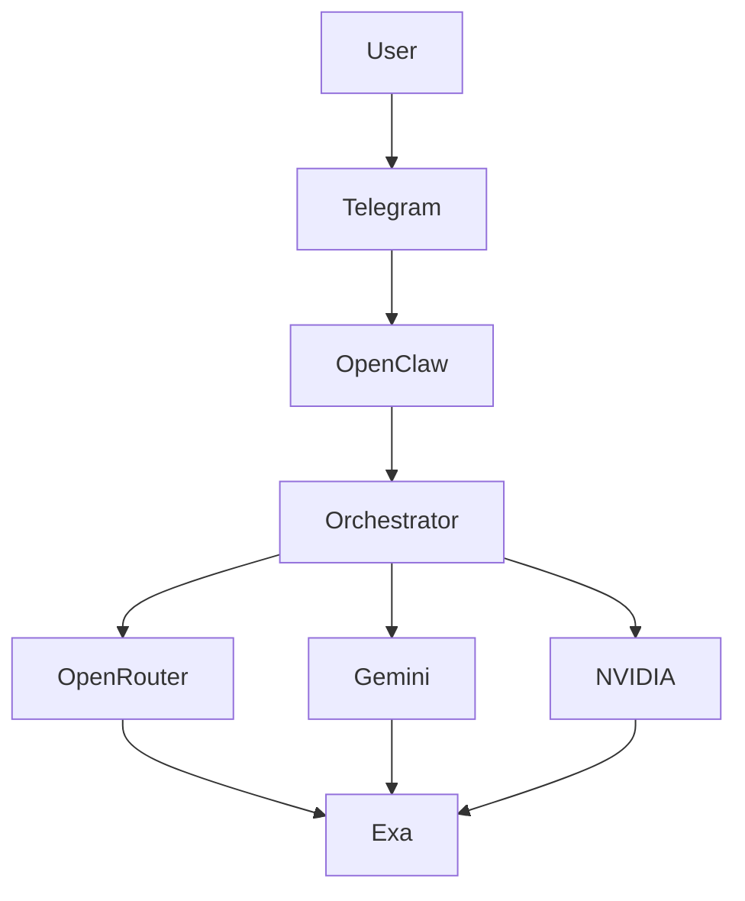
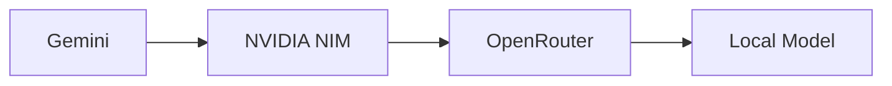

# Architecture Diagrams

## High Level

```mermaid
flowchart TD

User --> Telegram
Telegram --> OpenClaw

OpenClaw --> Orchestrator

Orchestrator --> OpenRouter
Orchestrator --> Gemini
Orchestrator --> NVIDIA

OpenRouter --> Exa
Gemini --> Exa
NVIDIA --> Exa
```

## Provider Failover

```mermaid
flowchart LR

Primary[Gemini]

Primary --> Backup1[NVIDIA NIM]

Backup1 --> Backup2[OpenRouter]

Backup2 --> Backup3[Local Model]
```
